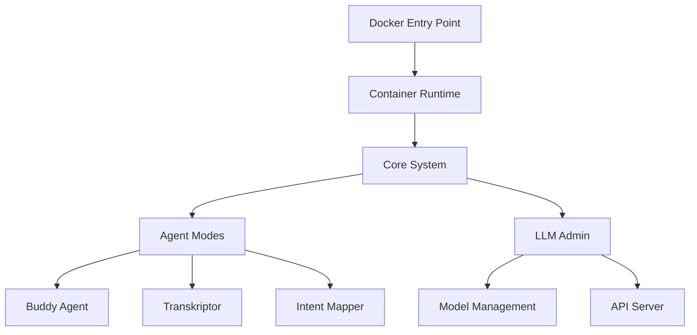

# RooCode Architecture Overview

## System Architecture

The RooCode Local Agent System follows a modular, containerized architecture designed for deterministic AI workflows.

### Directory Structure

```
├── core/                    # System-critical components
│   ├── modes/              # Agent mode definitions
│   ├── templates/          # YAML templates for CI validation
│   ├── ci/                 # CI rules and validation scripts
│   ├── config/             # Core system configuration
│   └── tests/              # Test suite
├── modules/                # Hot-swappable extensions
│   └── llm-admin/         # LLM management module
├── docs/                   # Component-specific documentation
│   ├── architecture/      # Architecture documentation
│   ├── components/        # Component documentation
│   ├── api/               # API documentation
│   └── deployment/        # Deployment guides
└── pim/                   # Project Information Management
    ├── tasks/             # YAML-based task definitions
    └── status.yaml        # Current execution status
```

## Core Principles

### 1. Containerization First
- All functionality runs in Docker containers
- No local dependencies required
- Single entry point via `docker-run.ps1`

### 2. Modular Design
- **Core**: System-critical, immutable components
- **Modules**: Hot-swappable, optional functionality
- **Docs**: Comprehensive documentation

### 3. Deterministic Workflows
- YAML-based configuration
- CI-validated structures
- Reproducible execution

### 4. Agent-Based Processing
- Mode-specific agents (buddy, transkriptor, intent-mapper)
- Tool-based capabilities
- Workflow orchestration

## Component Interaction



## Data Flow

1. **Input**: User requests via API or CLI
2. **Processing**: Agent-specific workflows
3. **Orchestration**: Buddy agent coordinates
4. **Output**: Structured results and logs

## Configuration Management

- **Templates**: Define structure and validation rules
- **Modes**: Agent-specific configurations
- **Active Config**: Runtime model and engine settings
- **Environment**: Docker-specific variables

## Validation and CI

- **Structure Validation**: YAML schema compliance
- **Template Conformity**: Adherence to defined templates
- **Referential Integrity**: Cross-reference validation
- **Test Suite**: Automated testing framework
